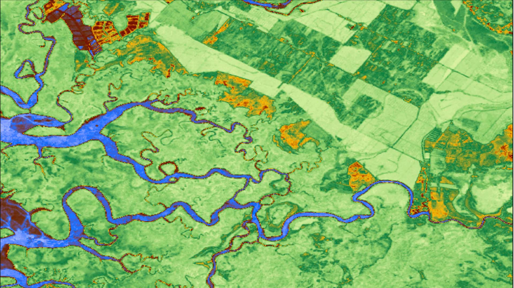
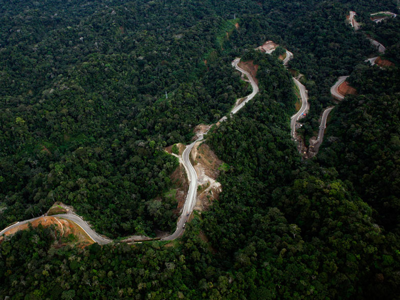
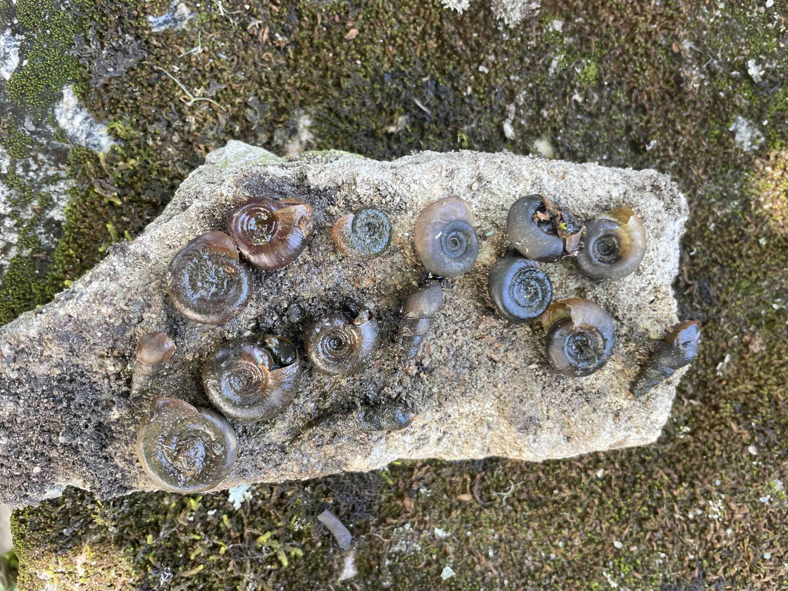

# **Land-use change and vector-borne disease**

 Unrecognized to much of the scientific community and the public, land-use change is as pervasive and threatening to human and planetary health as climate change. Over three-quarters of our Earth’s land surface has been altered by human beings during the last thousand years. Land-use change, or the intensification of human pressure imposed upon land, transforms natural environments into agricultural or urban areas. It alters biodiversity, habitat types, land cover variety, and ecological systems. Vector-borne diseases require non-human species (e.g., ticks, mosquitoes) for transmission, and are therefore particularly susceptible to these environmental changes due to their effects on vectors’ survival, reproduction, and contact with hosts. As humans impact and interact with the environment through deforestation, agricultural practices, and rapid urbanization, our vulnerability to various vector-borne diseases often increases. However, land-use change is not just a physical, environmental change but also a suite of social and demographic changes, including increased mobility, novel patterns of demography and population mixing, and changes in the human-environment interface. My research incorporates these multiple facets of land-use change to better understand its impacts on multiple vector-borne diseases with differing ecologies. 

# **Infrastructure projects and infectious disease**

 Infrastructure development and its resulting environmental and social changes have been associated with increased disease transmission across multiple settings and disease systems. However, very few studies have used causal analyses to directly estimate the effects of large-scale development projects, such as highways, dams, bridges, and pipelines, on infectious disease. Motivated by this knowledge gap, one of my projects investigates the effect of highway construction on dengue—a viral disease transmitted by mosquitoes—in the Amazon. The rapid paving of the Interoceanic Highway through a formerly isolated region of the Peru's Amazon basin in 2009 provides a unique opportunity to quantify the causal impact of road paving on disease transmission. A draft of this work is available as a [MedRxiv Preprint](https://www.medrxiv.org/content/10.1101/2024.11.15.24317406v1).

# **Species distribution modeling for disease ecology**

 In a recent [pair](https://journals.plos.org/globalpublichealth/article?id=10.1371/journal.pgph.0002224) of [papers](https://www.nature.com/articles/s41467-024-48335-9), I worked with an interdisciplinary, collaborative team of scientists and public health practitioners to reveal the impacts of urbanization and climate on Biomphalaria snails, the intermediate hosts of schistosomiasis. By linking species presence data from the field with remotely-sensed satellite data of potential environmental predictors, species distribution models are correlative models that can predict species habitat suitability across areas not sampled by field collection programs. They are then able to create high-resolution species suitability maps, which reflect areas where disease transmission may be possible. This body of work demonstrates how the snail’s habitat suitability has changed over time due to increasing urbanization and changing precipitation and drought patterns throughout Brazil. In addition to generating risk maps that can be used by public health officials, I saw an opportunity to make these novel computational methods accessible to researchers across the globe and across disciplines. Species distribution models are increasingly popular tools that can be leveraged to investigate any health or environmental problem that relies on a non-human species as a part of its system. My work analyzed the performance of species distribution models across species, machine learning model types, geographic extents, data sources, and data quantities, providing a road map of key methods and interpretations for other scientists to apply to a range of environmental problems. 
