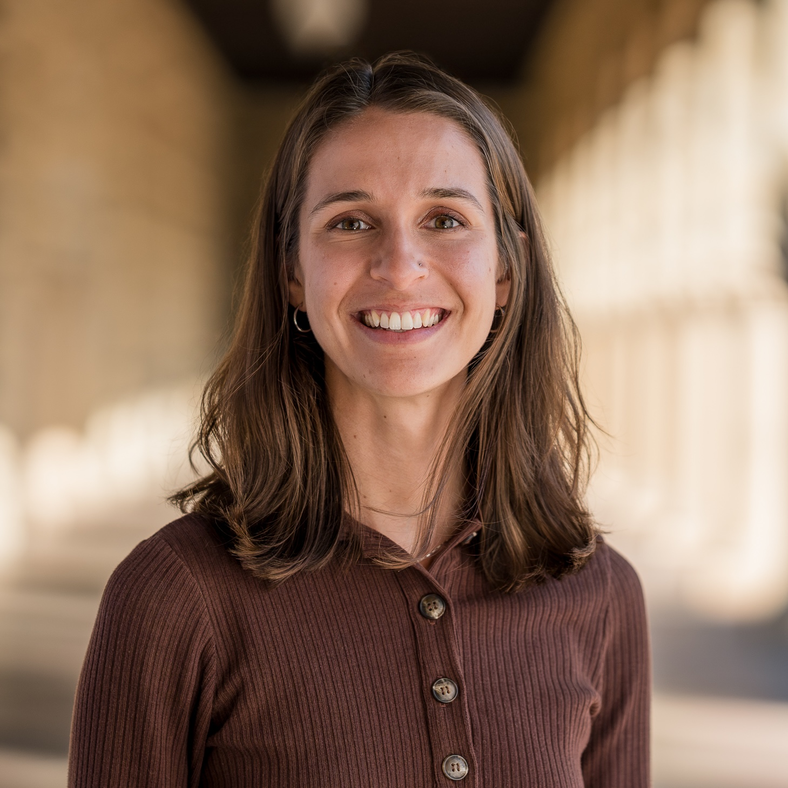

 
I am Planetary Health Postdoctoral Fellow at Stanford University, jointly affiliated with the [Stanford Center for Innovation in Global Health](https://globalhealth.stanford.edu/), the [Stanford Center for Human and Planetary Health](https://hph.stanford.edu/), and the [London School of Hygiene and Tropical Medicine](https://www.lshtm.ac.uk/). My research investigates the impact of global change on infectious disease transmission, through the lenses of ecology, socio-environmental systems, and infectious disease epidemiology. 

Based on the concepts of Planetary Health and One Health, I focus on the design and evaluation of win-win solutions that can synergistically benefit human and environmental health. As we anticipate widening disease disparities under increasing climate and land-use change, my research aims to identify opportunities to prevent and mitigate these compounding harms. I draw on tools from mathematics, statistics, machine learning, remote sensing, geography, epidemiology, applied econometrics, and social science to understand how global change processes combine to shape disease dynamics. Ultimately, my goal is to develop applied, science-based tools for disease control that increase the wellbeing of both people and ecosystems.

I am currently co-advised by [Marshall Burke](https://www.stanfordecholab.com/) and [Giulio De Leo](https://deleolab.stanford.edu/). I received my PhD from the Emmett Interdisciplinary Program in Environment & Resources ([E-IPER](https://eiper.stanford.edu/)) at Stanford University where I was co-advised by [Erin Mordecai](https://www.mordecailab.com/) and [Steve Luby](https://lubylab.stanford.edu/). Prior to my PhD, I was an ORISE Data Science Fellow at the Centers for Disease Control and Prevention where I developed analytic tools for outbreak detection and triage of multiple pathogens and supported the CDC’s Novel Coronavirus (COVID-19) Response. I conducted my undergraduate and master's research with the [People, Place & Health Collective](https://pphcollective.org/) at the Brown University School of Public Health while earning my undergraduate (BS, Applied Mathematics) and master's degrees (MA, Biostatistics).

[GitHub](https://github.com/alyson-singleton)

[Google Scholar](https://scholar.google.com/citations?user=YVUZhvUAAAAJ&hl=en)
